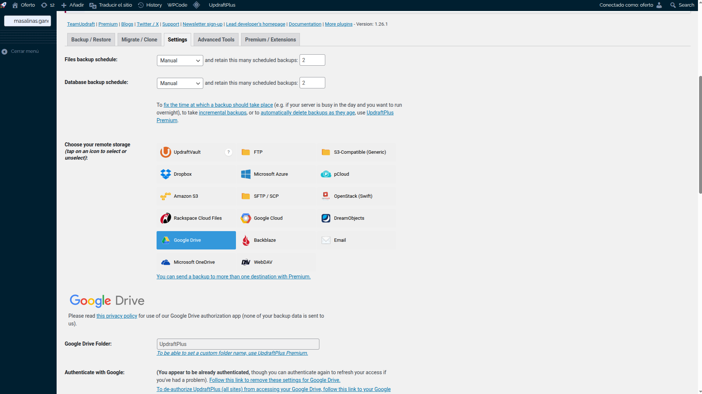
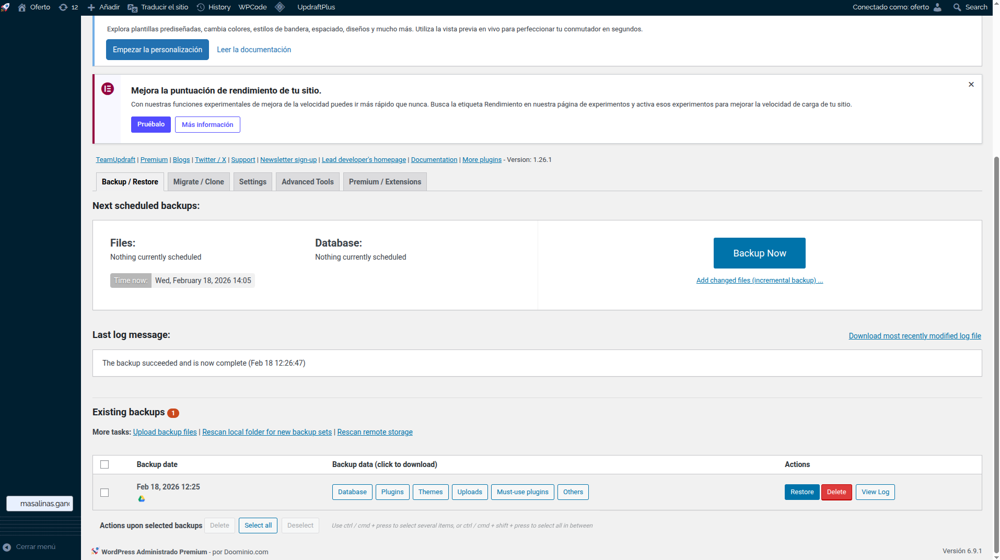

# Description
Backup/Restore a Wordpress portal from a remote Domain Server to local Docker deployment.

## Steps

- **Step 01**: Wordpress Backup

    - First we will install the plugin called [UpdraftPlus](https://wordpress.org/plugins/updraftplus/) from plugins Wordpress section to be easy the process. **We only need the free version to make manual Backup/Restore Wordpress portals**

    - Now inside the plugin just installed, go to the tab called **Settings** and configure the location where the backups will be saved. We will select the Google Drive from some google account. This free version will save the backup in a fix default folder called **UpdraftPlus**, so be carefull when execute the backup because the folder will be updated for each backup process.

    

    - Now we go to the first tab called **Backup/Restore** and click the big button called Backup Now. We select all resource to be backup: themes database, plugins, etc. Wait to finalize the backup and be uploaded to our Google Drive Folder. 


    

- **Step 02**: Deploy locally Wordpress

    We will use Docker as usual with MySQL as Wordpress DB service to persiste the data. Execute these commands:

    ```
    $ docker network create wordpress-net

    $ docker run -d \
    --name wordpress_db \
    --network wordpress-net \
    -e MYSQL_DATABASE=wordpress \
    -e MYSQL_USER=wp_user \
    -e MYSQL_PASSWORD=wp_password \
    -e MYSQL_ROOT_PASSWORD=root_password \
    -v db_data:/var/lib/mysql \
    mysql:8.0
    
    $ docker run -d \
    --name wordpress_oferto \
    --network wordpress-net \
    -p 8080:80 \
    -e WORDPRESS_DB_HOST=wordpress_db \
    -e WORDPRESS_DB_USER=wp_user \
    -e WORDPRESS_DB_PASSWORD=wp_password \
    -e WORDPRESS_DB_NAME=wordpress \
    -v wp_data:/var/www/html \
    wordpress:latest
    ```

After configure Wizard Worpress initialization. We will have a virgin Worpress to be restored.

- **Step 03**: Install plugins locally

We must install the same plugin **UpdraftPlus** locally to restore Wordpress with the similar version as installed in the cloud.

- **Step 04**: Restore Wordpress Backup
    - Now we must restore our backup located in our Google Drive Folder account. We must first configure the location of our backups selecting Google Drive from Settings, similar as cloud Wordpress versiona nd login using the same account where we save our backup in previous step.

    - Now go to the first tab **Backups/Restore** and click in the link called **Rescan remote storage** at the botton of the tab to list our backups localed in the Google Drive inside the folder **UpdraftPlus**. 

    - Now select this backuo and continue the wizard to backup all files: database, plugins, themes, etc locally.

    